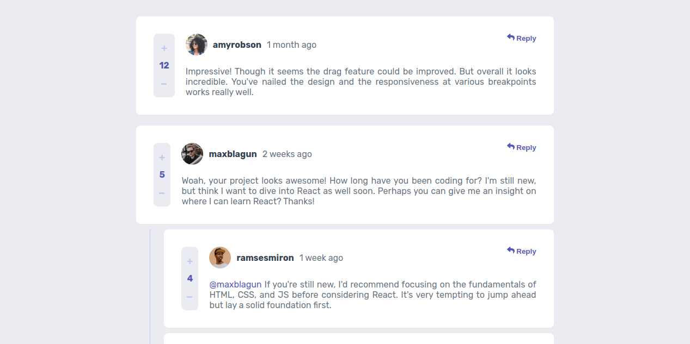

# Frontend Mentor - Interactive comments section

## Table of contents

- [Overview](#overview)
  - [Screenshot](#screenshot)
  - [Links](#links)
- [My process](#my-process)
  - [Built with](#built-with)
  - [What I learned](#what-i-learned)
- [Author](#author)

## Overview

### Screenshot

### Links

- Solution URL: (https://iteractive-comment-section.vercel.app/)

## My process

### Built with

- Semantic HTML5 markup
- CSS custom properties
- Flexbox
- Media Queries (Responsive)
- JavaScript

### What I learned

- I learned the using of Responsive media Queries
- I learned the use of the onscroll window method in JavaScript
- I learned the fetching data from a json file and display it to the html

## Author

- Website - [Fausto Machava](https://faustomachava.vercel.app/)
- Frontend Mentor - [@fausto-machava](https://www.frontendmentor.io/profile/fausto-machava)
- Github - [@fausto-machava](https://www.github.com/fausto-machava)
- LinkedIn - [@Fausto-Machava](https://www.linkedin.com/in/fausto-machava)
- Twitter - [@Fasthy3](https://www.twitter.com/fasthy3)
